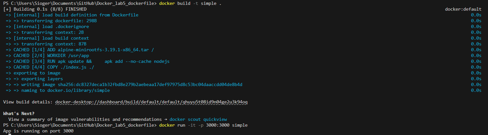
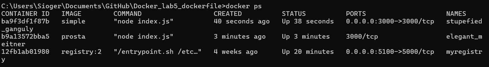
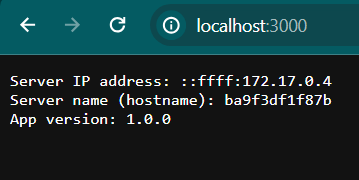

# Docker_lab5_dockerfile
 
# docker-lab-5-scratch-nodejs-nginx
Utilizing multi-stage builds with scratch and nginx images for hosting a Node.js application on an nginx server.

## Table of Contents

- [Requirements](#requirements)
- [Dockerfile](#dockerfile)
- [Image Building](#image-building)
- [Container Setup and Running](#container-setup-and-running)

## Requirements

For Linux and Windows systems Docker or Docker Desktop installed and running.

For Windows systems WSL installed.

## Dockerfile

Dockerfile used to build this image:

```dockerfile
# Stage 1
FROM scratch AS base

ADD alpine-minirootfs-3.19.1-x86_64.tar /

ARG VERSION=1.0.0

ENV APP_VERSION=$VERSION

WORKDIR /usr/app

RUN apk update && \
    apk add --no-cache nodejs
    
COPY ./index.js ./

EXPOSE 3000
CMD ["node", "index.js"]
```

## Image Building

Example for Windows:

Download files and open console. Change directory to the location of the downloaded files.

```cmd
cd C:\Users\Sioger\Documents\GitHub\Docker_lab5_dockerfile
```

If you need to edit any configuration files or make any changes, now is the time.

Save all changes if files were edited, then run the command to build a new image with Dockerfile named scratch-node-nginx-mix:

```cmd
docker build -t simple .
```
Example result from this command:



## Container Setup and Running

To create a container with the scratch-node-nginx-mix image, specify the modes it will run in (-d in this case), ports (-p portOnYourHostMachine:PortOnApacheServer(80 default for this image)), the name of the container (--name nginx-server in this case) and any additional options that will be needed. The example command below demonstrates how to create a container with the scratch-node-nginx-mix image.

```cmd
docker run -it -p 3000:3000 simple 
```

Afterward, the healthcheck status should be verified to ensure that the server is functioning properly. Example command:

```cmd
docker ps 
```

An example of the result from this command:



In the STATUS column, "Up" and "healthy" statuses are visible, indicating that the container is working properly.

After that, it is possible to access the Nginx server working on the running container through port 3000 in this case. Just type localhost:3000 in the browser search bar.



